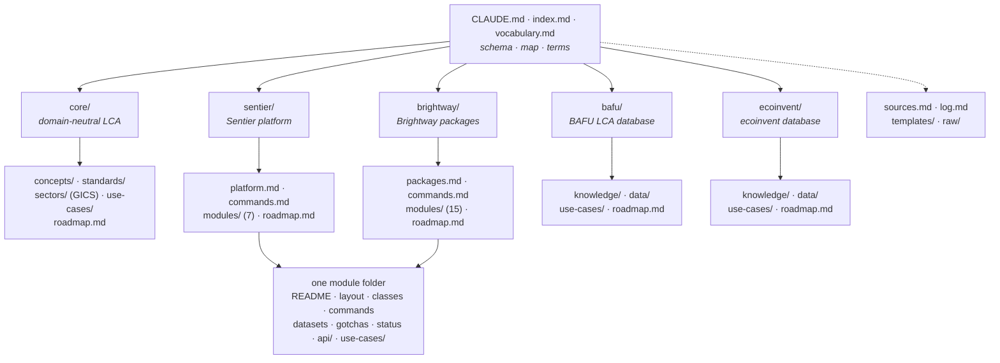

# LCA wiki

A public wiki about life cycle assessment (LCA) practice with [Brightway](https://docs.brightway.dev/) and [Sentier](https://sentier.dev/).
Plain markdown in git: readable on GitHub, cloneable by any LLM, no build step.
Maintained by agents and reviewed by people.
Started from the Brightcon 2026 hackathon proposal by [Départ de Sentier](https://d-d-s.ch/).

## How to read it

Start at [index.md](index.md): every page in one line, with a start-here block per reader.
Check [vocabulary.md](vocabulary.md) for what a term means: one heading per term, one bullet per source and context.
Then open the page you need.
Every claim carries a source id that resolves in [sources.md](sources.md).

An LLM reads it the same way: clone, then point the agent at [CLAUDE.md](CLAUDE.md) or its mirror [AGENTS.md](AGENTS.md).

## Who it is for

Practitioners: [core/use-cases/](core/use-cases/) for the method, [core/sectors/](core/sectors/) for your sector, then a module's `use-cases/` for verified commands.
Contributors: [CONTRIBUTING.md](CONTRIBUTING.md), then the `roadmap.md` of a branch.
Wiki developers: [CLAUDE.md](CLAUDE.md), then [templates/](templates/) to add a page or a whole community branch.

## Contributing

Keep every claim sourced and every page short.
There is no lint and no CI.
Before a pull request, check that your links resolve, your terms are in `vocabulary.md` and `index.md` lists every page you touched.
Details in [CONTRIBUTING.md](CONTRIBUTING.md).

## Licence

Content: CC-BY 4.0, see [LICENSE-CONTENT](LICENSE-CONTENT).
Code in `scripts/` and `install.sh`: MIT, see [LICENSE](LICENSE).
Generated `api/` folders keep their package's licence.
The ILCD PDF in [raw/ilcd/](raw/ilcd/) is reusable with attribution under Commission Decision 2011/833/EU.
