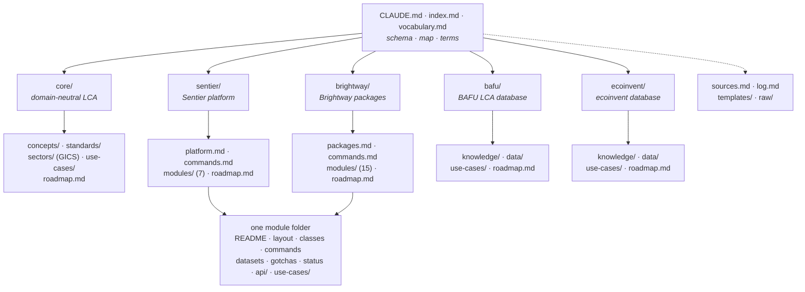

# LCA wiki

A public, agent-maintained wiki about life cycle assessment (LCA) practice with the
[Brightway](https://docs.brightway.dev/) and [Sentier](https://sentier.dev/) tooling.
Plain markdown in git: readable on GitHub, cloneable and greppable by any LLM, no build
step. It grew out of the Brightcon 2026 hackathon proposal by
[Départ de Sentier](https://d-d-s.ch/).

## How to read it

1. [index.md](index.md): every page, one line each, with a start-here block per reader.
2. [vocabulary.md](vocabulary.md): one heading per term, one bullet per source and
   context (ILCD, ISO, EF/PEF, ecoinvent, BAFU, Sentier, Brightway), never merged.
3. The page you need. Every claim carries a `sources:` id that resolves in
   [sources.md](sources.md).

An LLM reads it the same way: `git clone`, then point the agent at
[CLAUDE.md](CLAUDE.md) (tool-neutral mirror: [AGENTS.md](AGENTS.md)).

## Who it is for

- **Practitioner:** [core/use-cases/](core/use-cases/) for the method, your sector under
  [core/sectors/](core/sectors/), then a module's `use-cases/` for verified commands.
- **Contributor:** [CONTRIBUTING.md](CONTRIBUTING.md), then the `roadmap.md` of a branch.
- **Wiki developer:** [CLAUDE.md](CLAUDE.md), then [templates/](templates/) to add a
  page or a whole community branch.

## Contributing

Keep every claim sourced and every page short. There is no lint and no CI: before a pull
request, check by hand that your links resolve, your terms are in `vocabulary.md` and
`index.md` lists every page you touched. Details in [CONTRIBUTING.md](CONTRIBUTING.md).

## Licence

Content CC-BY 4.0 ([LICENSE-CONTENT](LICENSE-CONTENT)); code in `scripts/` and
`install.sh` MIT ([LICENSE](LICENSE)); generated `api/` folders keep their package's
licence; the ILCD PDF in [raw/ilcd/](raw/ilcd/) is reusable with attribution under
Commission Decision 2011/833/EU.
